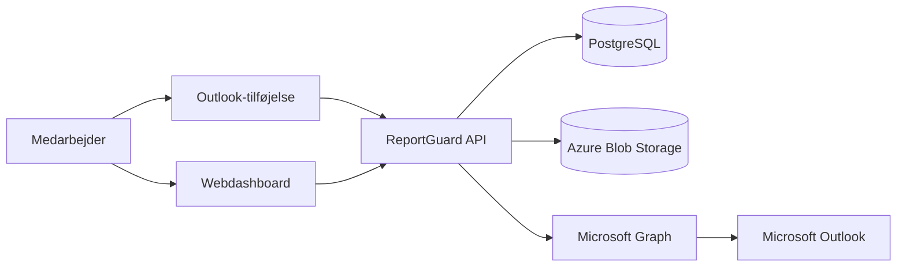
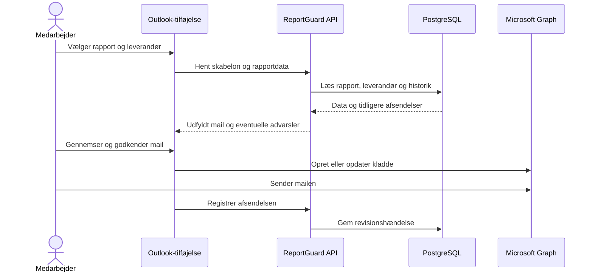

# Systemarkitektur

## Formål

ReportGuard hjælper medarbejdere med at oprette ensartede leverandørmails fra
servicerapporter og advarer, når en rapport muligvis allerede er sendt.

Den første version forbereder en mail, men brugeren godkender og sender den selv.

## Teknologistak

| Område | Valg |
| --- | --- |
| Sprog | TypeScript |
| Dashboard | React og Vite |
| Outlook-tilføjelse | React og Office.js |
| API | NestJS og REST |
| Database | PostgreSQL med Prisma |
| Login | Microsoft Entra ID |
| Outlook-integration | Microsoft Graph |
| Filer | Azure Blob Storage |
| Drift | Docker, Azure og GitHub Actions |

## Systemdiagram

## Arkitekturprincipper

1. Løsningen starter som en modulær monolit, ikke som microservices.
2. Backend er den eneste komponent med direkte databaseadgang.
3. Afsendelser registreres i ReportGuards egen revisionslog.
4. Outlook-mails sendes ikke automatisk i den første version.
5. Microsoft-rettigheder begrænses til det mindst nødvendige.
6. Hemmeligheder og adgangstokens må aldrig gemmes i repositoryet.

## Første produktflow

