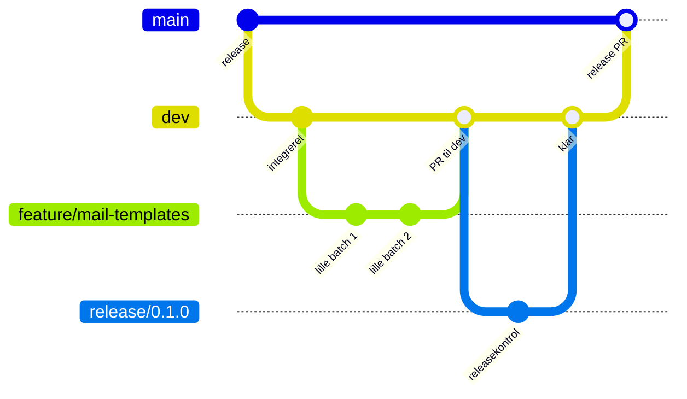

# Branchingstrategi

## Permanente branches

### `dev`

- Repositoryets standardbranch.
- Alt løbende arbejde integreres her via pull requests.
- Nye arbejdsbranches oprettes altid fra en opdateret `dev`.

### `main`

- Indeholder kun releaseklar kode.
- Direkte commits og almindelige feature-pull-requests er ikke tilladt.
- Opdateres kun med en release-pull-request fra `dev`.

## Kortlivede branches

Navngivning:

```text
feature/<kort-navn>
fix/<kort-navn>
docs/<kort-navn>
chore/<kort-navn>
release/<version>
```

Eksempel på udviklingsflow:



## Small batching

- Hver branch løser én afgrænset opgave.
- Hver commit skal være lille, sammenhængende og kunne tilbageføres selvstændigt.
- Dokumentation og tests følger den funktion, de beskriver.
- Pull requests skal være små nok til at kunne gennemgås hurtigt.
- Squash bruges ikke, hvis det vil fjerne nyttige, selvstændige rollback-punkter.

## Pull requests

| Fra | Til | Formål |
| --- | --- | --- |
| `feature/*`, `fix/*`, `docs/*`, `chore/*` | `dev` | Dagligt arbejde |
| `release/*` | `dev` | Releaseforberedelse |
| `dev` | `main` | Godkendt release |

Før merge skal relevante automatiske kontroller bestå, og pull requesten
skal forklare formål, ændringer, test og mulig rollback.
