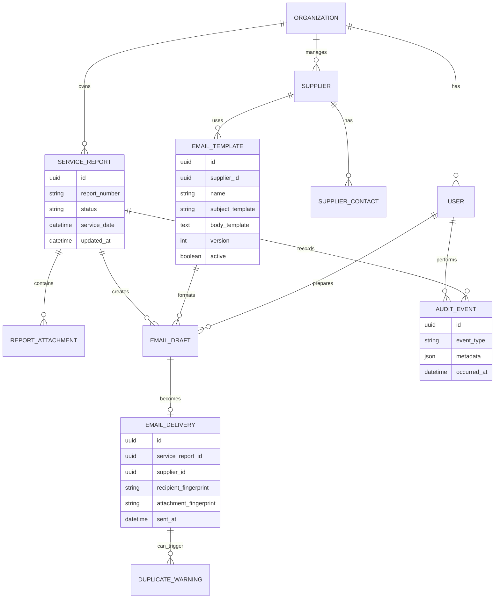

# Domænemodel

Dette er den første konceptuelle model. Den er ikke endnu et endeligt
databaseskema.

## Regler for dubletkontrol

En mail markeres som en mulig dublet, hvis mindst én af følgende kombinationer
allerede findes:

- Samme rapportnummer og leverandør.
- Samme rapportnummer og modtager.
- Samme vedhæftningsfingeraftryk og modtager inden for en fastsat periode.

En advarsel stopper ikke permanent afsendelsen. Brugeren kan fortsætte med en
begrundelse, som gemmes i revisionsloggen.
